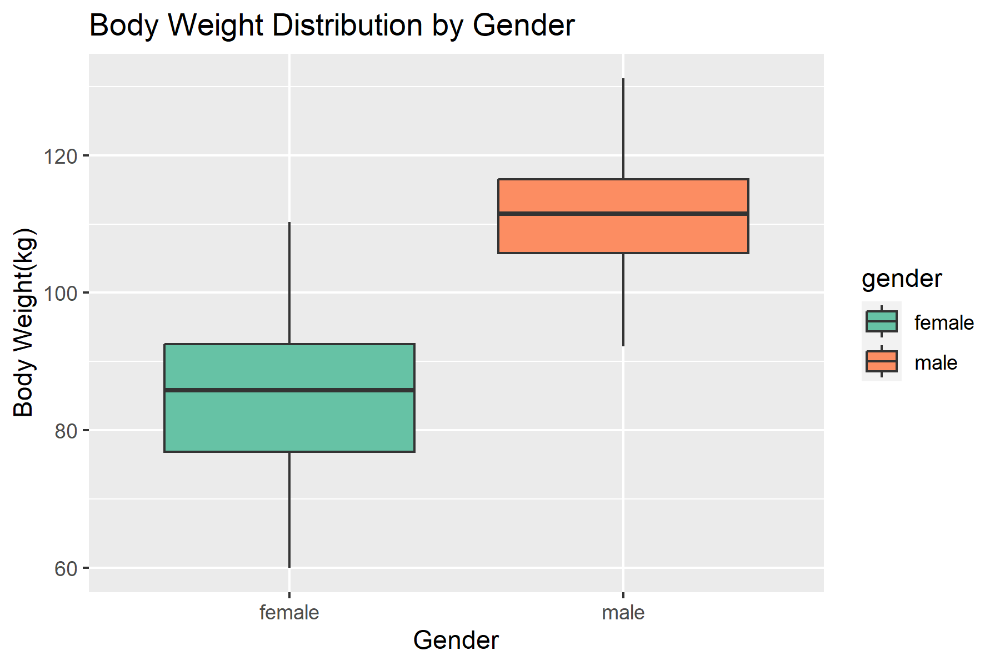

# Weightlifting Statistics Case Study

**Author:** Gishor Thavakumar  

**Tools & Technologies:** 


**Topics:** Statistical Analysis, Data Visualization, Hypothesis Testing  

---

## 🚩 Overview

This project presents a detailed statistical analysis of a weightlifting dataset, exploring relationships between gender, body weight, age, and weightlifting performance. Statistical techniques including exploratory data analysis, hypothesis testing, and regression modeling were applied using R.

---

## 🎯 Research Questions

- **RQ1:** Is there a difference in the average age between female and male weightlifters?
- **RQ2:** What relationship exists between body weight and maximum weight lifted, considering gender differences?

---

## 📈 Methods Used

- **Exploratory Data Analysis (EDA)**: Boxplots, Bar charts
- **Hypothesis Testing**: Independent t-tests for comparing means
- **Regression Analysis**: Linear regression separated by gender groups

---

## 🗃️ Dataset

A simulated dataset with 274 participants covering:
- Gender distribution
- Age (years)
- Body weight (kg)
- Maximum weight lifted (kg)

**Dataset Location:** `data/48032875_data_StatReport.csv`

---

## 📊 Key Visualizations

**Gender Distribution**  


**Age Distribution by Gender**  


**Body Weight Distribution by Gender**  


**Weight Lifted Distribution by Gender**  


---

## 📌 Findings and Insights

- **Age Comparison**:  
  No statistically significant age difference was found between male and female weightlifters (p-value = 0.1289).

- **Body Weight & Weight Lifted Relationship**:  
  A clear positive correlation was observed between body weight and weight lifted, stronger among males (R² = 0.81) compared to females (R² = 0.53).

---

## 🚀 Running the Analysis

1. Clone the repository.
2. Open `analysis.Rmd` in RStudio.
3. Install required packages (`ggplot2`).
4. Knit to PDF/HTML or run individual code chunks.

```R
install.packages(\"ggplot2\")
library(ggplot2)
```
---
## 🔖 Files Included

* [`Statistical_Report.pdf`](Statistical_Report.pdf)
* [`analysis.Rmd`](analysis.Rmd)
* [`data/48032875_data_StatReport.csv`](data/48032875_data_StatReport.csv)

---

## 📌 License

This project is licensed under the MIT License.

---

## 🤝 Connect with me

* **GitHub:** [Your GitHub Link](https://github.com/your-profile)
* **LinkedIn:** [Your LinkedIn Link](https://linkedin.com/in/your-profile)

